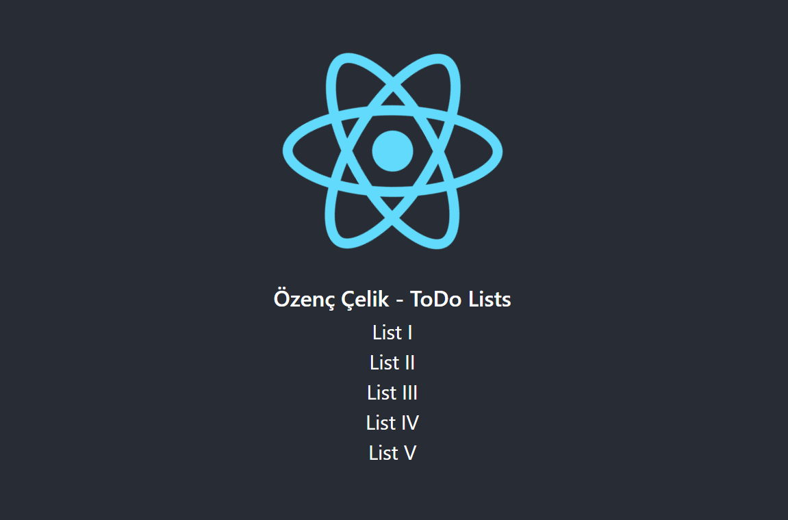
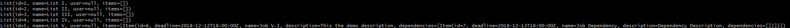

# DoDo App using Spring Boot and React.js framework.

## Installation
Firstly, you need to install [Yarn](https://yarnpkg.com/lang/en/docs/install/) to use `yarn` and [Git](https://git-scm.com/downloads) to use `git` in command prompt,

Open up your favorite terminal and write,
`git clone https://github.com/ozencelik/DoDo-App`

### In order to run React Project
1. `cd dodo`
2. `cd frontend-react`
3. `yarn install`
4. `yarn start`

### In order to run Spring Project
1. `cd dodo`
2. `cd web-services-spring`
3. `./mvnw spring-boot:run`

With `--why`, Size Limit can tell you *why* your library is of this size
and show the real cost of all your internal dependencies.

  

With `--why`, Size Limit can tell you *why* your library is of this size
and show the real cost of all your internal dependencies.

  

## Note:
 React uses `_localhost:3000_` and Spring API uses `_localhost:8080_`. In order to run both of them, the ports 8080 and 3000 must be accessible and usable.
### Write this command to check the task for the specific port : `netstat -ano | findstr :8080`. If the port is busy now, you can kill the task by using taskid : `TASKKILL //PID 10524 //F`.**

## Made with ❤ in İzmir by Özenç Çelik